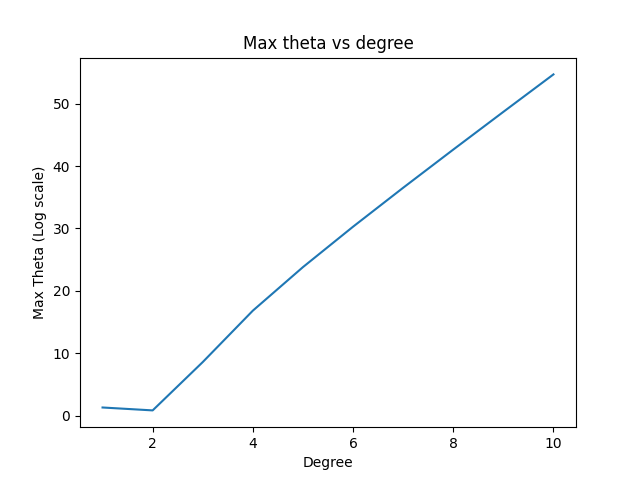

# ES654-2020 Assignment 3

*Kalyan* - *18110079*

------

## Magnitude of theta v/s degree

1. Here I took the log(max(theta)) in y-axis and degree in x-axis

2. The Graph for the above: 
    
    > 

