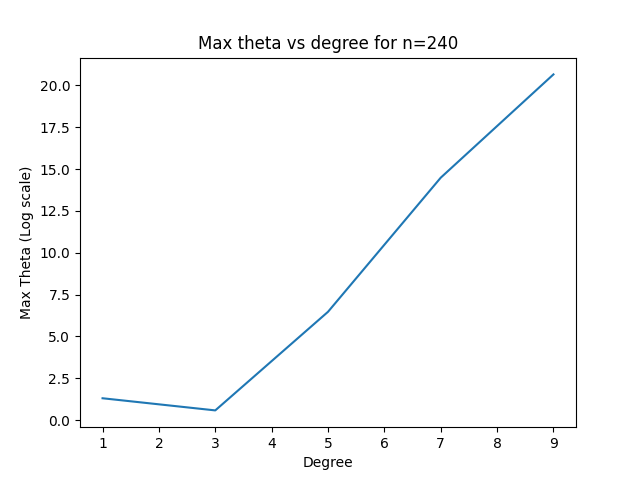
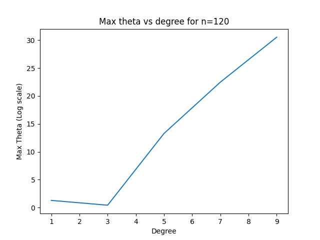
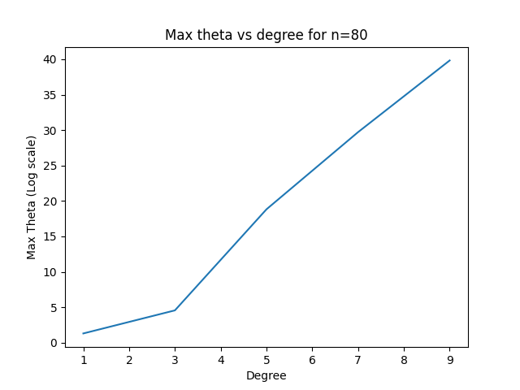
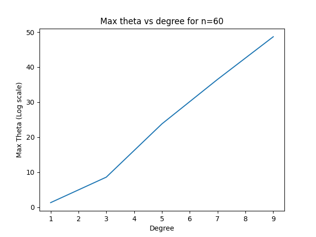

# ES654-2020 Assignment 3

*Your Name* - *Your Roll Number*

------

## Magnitude of theta v/s degree for different N

1. Here I took the log(max(theta)) in y-axis and degree in x-axis

2. The Graph with N=240 : 
    
    > 

3. The Graph with N= 120: 
    
    > 

4. The Graph with N= 80: 
    
    > 

5. The Graph with N= 60: 
    
    > 

Here we can see that Theta value increases as N decreases, showing that its over fitting
